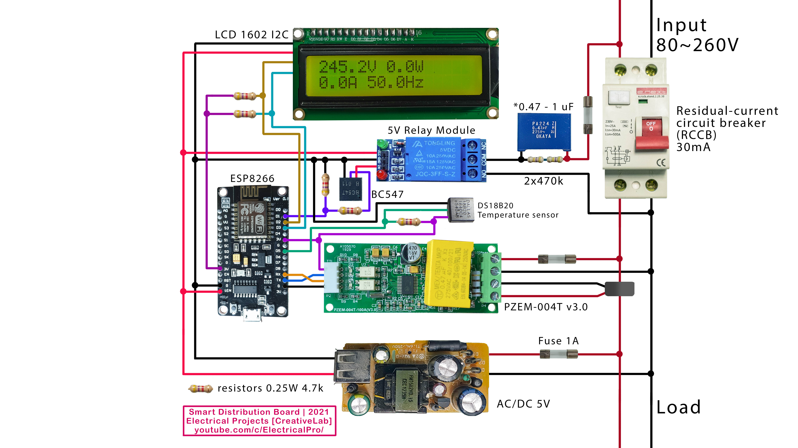

# Smart Distribution Board (IoT Based)

Here I Have attached all the files required to deploy this project successfully in your home system.

Inspired by @electrical-pro Watch how it he made it https://youtu.be/YGajnfcQebY

[](http://www.youtube.com/watch?v=YGajnfcQebY "Video Title")

This is the final curcuit:


# This are the components you need for the project: 

RCCB: 30mA 80-260v (1)

PZEM-004T: https://s.click.aliexpress.com/e/_9hYStD (1)

NodeMCU ESP8266: https://s.click.aliexpress.com/e/_97j7kp (1)

Resistors: 4.7k (5) , 470k (2)

Capacitor: 0.47uF 275v (1)

5V relay module: https://s.click.aliexpress.com/e/_AAXY9i (1)

16x2 I2C Display: https://s.click.aliexpress.com/e/_AF3L2o (1)

Transistor: BC547 (1)

Thermal Sensor: DS18B20 (1)

Fuse: 1 amps (3)

5V Charger: 1

# Step-by-Step Instruction mentioned below:-

## Compilation
Use core 3.0.2 for this project (Tested with this version)


please download the necessary libraries:
https://github.com/Dhruvp25/Smart-Distribution-Board/libraries.zip

Paste these libraries to:
C:\Users<USERNAME>\Documents\Arduino\libraries

## Uploading files from data folder to esp8266 (flash memory)
The project uses LittleFS to store files and upload them to the ESP8266 (read about LittleFS steps down below.)


If you don't see this option install the plugin from here: https://github.com/earlephilhower/arduino-esp8266littlefs-plugin/releases

## Connecting to Router Wi-Fi
After flashing WiFi will be available as "PowerControlESP | Offline" pass is "PowerControlPass" connect and go to 192.168.4.1 and connect to your Wi-Fi router.


After Successful connection go to:

Power server is at 192.168.__.__:8089 (port is 8089)

## Serial Note
Note that we use Serial for PZEM004Tv30 module:
```cpp
PZEM004Tv30 pzem(&Serial);
```
Other information goes to Serial1 not Serial (so you will not see things in serial monitor)
 ```cpp 
Serial1.begin(115200);
 ``` 
